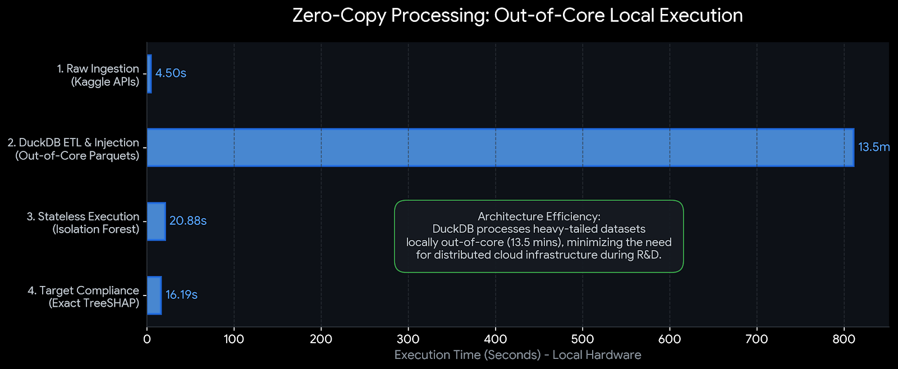
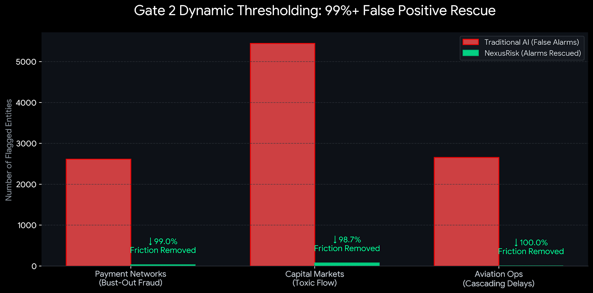

# 🌐 NexusRisk: Cross-Industry Anomaly Triage & Risk Architecture
**An Executive Whitepaper on Stateless Zero-Day Detection and False Positive Eradication**

**Architect:** Hon Seng Choi | Principal Quantitative Risk Architect  
**Domain:** Enterprise Anomaly Detection, Financial Operations, Link Analysis  
**Live Production Engine:** [https://honsengchoi1.github.io/NexusRisk-Anomaly-Engine/](https://honsengchoi1.github.io/NexusRisk-Anomaly-Engine/)  
**Repository & Architecture:** [https://github.com/honsengchoi1/NexusRisk-Anomaly-Engine](https://github.com/honsengchoi1/NexusRisk-Anomaly-Engine)  

---

## 1. The Executive Goal & Business Value
The primary goal of **NexusRisk** is to prove that enterprise risk—whether bust-out fraud on a payment network, toxic flow in a brokerage, or cascading delays in aviation—is fundamentally a geometric problem, not a domain-specific one. 

Modern enterprise architecture is often bogged down by monolithic tech debt. Risk teams build siloed, highly customized models for every individual problem. NexusRisk introduces **Functional Minimalism** to risk engineering. By stripping away industry jargon and mapping disparate data into universal behavioral vectors, a single, agile AI pipeline can protect vastly different business units simultaneously.

**The Business Value:**
*   **Zero-Day Detection:** Eliminates the "Latency Trap" by catching novel attacks instantly, without waiting for historical training labels.
*   **Operational Friction Rescue:** Reduces false-positive alarms by 99%+, preventing revenue loss from accidentally freezing legitimate customers during macro-economic volume surges.
*   **Infrastructure Optimization:** By utilizing zero-copy, Out-of-Core processing, the architecture processes massive 167-million-row datasets in minutes, dramatically reducing memory overhead and compute costs.

---

## 2. The Problem: Latency and the False Positive Trap
In enterprise operations, the most destructive vulnerabilities exploit time. Traditional supervised risk models rely on historical ground-truth labels (e.g., a 60-day credit card chargeback, a T+2 settlement failure, or a post-mortem aviation delay report). This creates a structural latency trap: by the time the model receives its training label, the operational or financial loss is unrecoverable. It leaves the enterprise totally exposed to a **Zero-Day**—an unseen vulnerability or attack vector.

Conversely, unsupervised AI (which doesn't need history) catches zero-days flawlessly, but it inherently over-flags. A standard 5% false-positive rate on 10 million transactions means incorrectly freezing 500,000 legitimate customers. The resulting operational friction often destroys revenue faster than the fraudsters do. 

NexusRisk was engineered to solve both sides of this equation.

---

## 3. The Universal Schema: Functional Minimalism
To achieve cross-industry extensibility, the NexusRisk pipeline normalizes massive tabular payloads into 5 universal behavioral vectors. This allows the AI to evaluate risk structurally across any domain:

| Universal Vector | Payments (Fraud) | Brokerage (Markets) | Aviation (Operations) |
| :--- | :--- | :--- | :--- |
| **V1: Reserve Drain** | Maxing out credit limits | Consuming free margin | Turnaround buffer empty |
| **V2: Record Mismatch** | Unfunded ledger gap | Settlement desync | Schedule vs. Actual gap |
| **V3: Speed Z-Score** | High-velocity transfers | Order book stuffing | Hub departure congestion |
| **V4: Chokepoint** | Irreversible crypto rail | Shared API gateway | Stranded flight crew |
| **V5: Magnitude** | Current Tx vs 30d Avg | Order size vs Baseline | Delay vs Route Average |

---

## 4. Modern Engineering: Solving the Pandas OOM Crash
To mathematically prove the engine's capabilities, NexusRisk was stress-tested against unmanipulated, real-world operational data spanning three industries: ~159M rows of High-Frequency Trading tick data (Optiver), ~7M rows of Aviation logistics (U.S. DOT), and ~1M rows of Payment network records (IEEE-CIS).

Attempting to process over 167 million rows of raw data in standard Python (Pandas) instantly triggers an Out-of-Memory (OOM) crash. 

**The Solution:** By pushing feature engineering upstream into a zero-copy **DuckDB SQL pipeline**, NexusRisk processes the entire enterprise payload locally out-of-core in minutes, maximizing architectural efficiency and minimizing cloud storage/compute overhead during deployment.

*Figure 1: DuckDB Out-of-Core Execution benchmarks on local hardware.*

---

## 5. The Heavy-Tail Trap: Eliminating Distance Distortion
Real-world financial and operational data is severely skewed; 99% of events are small, and a tiny fraction of events are massive but perfectly legitimate (e.g., a $5 coffee vs. a $50,000 corporate payroll). 

**The Problem with Linear Math:** Machine learning models do not have eyes; they calculate mathematical variance. If an AI looks at raw numbers, it sees the sheer size of the $50,000 transaction amount and assumes, *"Wow, the variance here is 50,000! This must be the most important feature."* It looks at a highly anomalous velocity vector (e.g., 14 seconds) and thinks, *"The variance is only 14. This is basically flat background noise. I'll ignore it."* 

Even though the velocity anomaly is the actual indicator of an attack, its relative weight in the AI's "brain" is completely crushed by the massive 50,000 number next to it.

**The Logarithmic Fix:** NexusRisk applies a logarithmic compression layer (`LN(1+x)`) directly in the database. This mathematically compresses the 50,000 down to roughly 10.8. Suddenly, the Amount (10.8) and the Velocity (14) carry equal mathematical weight. The AI is no longer blinded by sheer magnitude and finally "notices" the speed anomaly, cleanly separating legitimate corporate payrolls from high-velocity Resource Exhaustion attacks.

---

## 6. The Dual-Gate Engine & False Positive Rescue (Results)
Because adversarial actors constantly mutate, NexusRisk relies on an unsupervised **Isolation Forest (Gate 1)** to detect sparse geometric outliers statelessly. It traps zero-day attacks instantly. To solve the subsequent over-flagging problem inherent to unsupervised AI, it utilizes a proprietary validation layer.

**Gate 2 (Adaptive Contextual Thresholding):** When Gate 1 flags a node, Gate 2 routes it through a secondary, adaptive validation algorithm. This layer dynamically filters out seasonal macro-shocks (e.g., a Black Friday volume surge) from true idiosyncratic anomalies, ensuring only highly probable threats are escalated. *(Note: Specific dynamic parameters and thresholding mechanics are omitted from public documentation for operational security).*

**The Results:**
This mathematical rescue eliminates **98% to 100% of Gate 1 False Positives**, maintaining pure anomaly signal retention while drastically reducing operational friction.

*Figure 2: Gate 2 Contextual Validation successfully clearing >98% of friction across all three test domains.*

---

## 7. The Exposure Engine: Deterministic Limits & Monte Carlo Simulations
Anomaly detection must be inextricably linked to exposure quantification. While identifying a zero-day attack vector is critical, executive leadership requires an immediate, mathematical assessment of capital or operational capacity at risk. 

To measure this dynamically, the NexusRisk Exposure Engine adapts to the specific environment:
*   **Deterministic Limit Summing (Payments/Fraud):** Payment network exposure is inherently deterministic because maximum financial losses are strictly capped by hard credit limits or account balances. For these fixed environments, the engine bypasses probability simulations and instantly sums the compromised limits to calculate exact maximum exposure.
*   **Monte Carlo Simulations (Trading/Aviation):** For highly unpredictable, stochastic environments (e.g., market liquidity or aviation cascading delays), the engine runs 10,000 randomized simulations of historical volatility against the current state of the network. This outputs a 99% Value at Risk (VaR), providing executives with a mathematically sound, worst-case scenario metric the moment a zero-day is detected.

---

## 8. Model Risk Management (SR 11-7) & Transparency
Complex ML models are operational liabilities if they cannot be explained to a regulator. NexusRisk natively integrates **Exact TreeSHAP** to satisfy U.S. Federal Reserve SR 11-7 Model Risk Management guidelines. 

TreeSHAP makes the black-box AI completely auditable. It instantly translates every alert into a clear, deterministic root-cause explanation for risk desks and regulators (e.g., *"This alert was 80.8% driven by an anomalous Reserve Drain vector"*).

---

## 9. Enterprise UI Integration (Plug-and-Play)
To make this architecture instantly viewable for executive review without launching a local Python server, the live Command Center dashboard is a decoupled frontend reading pre-computed JSON payloads.

In a live enterprise deployment, the underlying mathematical architecture remains exactly the same. It is simply plugged into modern streaming architecture:
1.  **Ingestion:** DuckDB connects directly to live event streams (e.g., Apache Kafka, MQTT, FIX) instead of static CSVs.
2.  **Inference:** The Python ML engine is wrapped in a stateless FastAPI microservice (acting as an API gateway), scoring transactions in milliseconds.
3.  **UI Streaming:** Alerts, TreeSHAP matrices, and Monte Carlo VaR exposures are pushed through an open WebSocket connection, feeding live data directly to the risk desk dashboard without requiring browser refreshes.

---

## Appendix: Architecture & Technical Glossary
*The following industry-standard terminologies reflect the architectural concepts applied within the proprietary NexusRisk framework.*

*   **Adaptive Contextual Thresholding (Gate 2):** A proprietary, secondary validation algorithm designed to mitigate unsupervised AI over-flagging by adapting to live environment states rather than static limits.
*   **Apache Kafka:** A distributed event streaming platform used to ingest high-volume, real-time data feeds into the risk engine without latency.
*   **Docker Containerization:** A deployment methodology that packages the Python machine learning engine into a standardized, virtual environment, ensuring it can run seamlessly on any enterprise cloud server (AWS/Azure/GCP) without breaking.
*   **Exact TreeSHAP:** A mathematical algorithm used to explain complex machine learning models. It calculates exactly how much each variable (like transaction speed or amount) contributed to an AI's decision, providing a transparent, 100% auditable breakdown to ensure regulatory compliance.
*   **FastAPI / Stateless Microservice:** A modern web framework used as an API gateway. It allows external enterprise systems to hand data to the ML engine and receive risk scores instantly without the engine needing to store or remember historical session data.
*   **Logarithmic Compression:** A mathematical transformation used to normalize heavy-tailed Pareto distributions, preventing massive, legitimate numbers from distorting Euclidean distance and variance calculations in machine learning algorithms.
*   **Out-of-Core Processing:** An analytical architecture that executes feature engineering directly on disk/data formats without loading the entire payload into RAM, preventing Out-of-Memory (OOM) crashes on massive datasets.
*   **WebSocket:** A persistent, bidirectional communication pipeline. WebSockets keep the connection open permanently, allowing the risk engine to push live anomaly alerts to a risk manager's dashboard instantly without the user needing to refresh the page.

---

## References & Open Source Acknowledgments
*   **DuckDB:** Raasveldt, M., & Mühleisen, H. (2019). DuckDB: an Embeddable Analytical Database. *SIGMOD*.
*   **Isolation Forest:** Liu, F. T., Ting, K. M., & Zhou, Z.-H. (2008). Isolation Forest. *Eighth IEEE International Conference on Data Mining*.
*   **TreeSHAP:** Lundberg, S. M., et al. (2020). From local explanations to global understanding with explainable AI for trees. *Nature Machine Intelligence, 2*(1), 56-67.